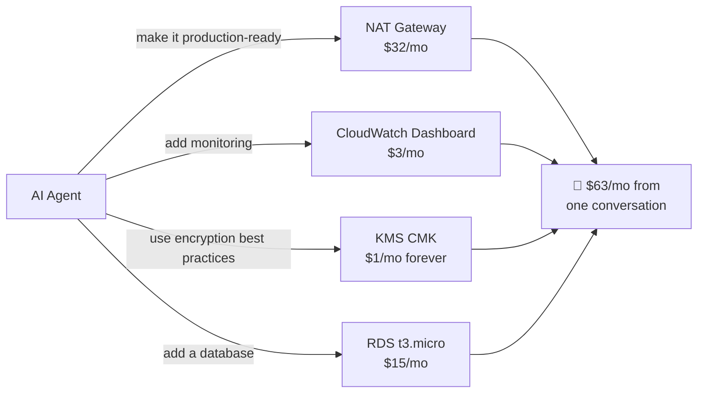
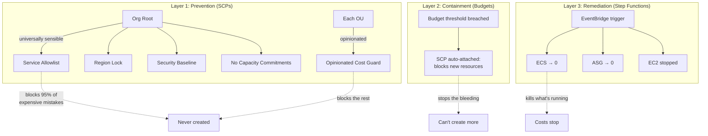

# cloud-mgmt

**Guardrails for personal AWS accounts in the age of AI coding assistants.**

Your AI assistant just offered to "make this production-ready." It added a NAT
Gateway ($32/month), an Application Load Balancer ($16/month), and an RDS
instance ($15/month). You said "yes" because it sounded reasonable. Budget
alerts fire 8 hours later. You're $63/month heavier — on a hobby project.

This repository prevents that. Not with monitoring. Not with alerts. With
**hard denials at the AWS Organization level** that no IAM policy, no human, and
no AI agent can override.

```
$ aws ec2 create-nat-gateway --subnet-id subnet-abc123
An error occurred (UnauthorizedOperation): explicit deny in a service control policy
```

## This is for you if

- You run a personal AWS account and pay from your own pocket
- You use AI coding assistants (Copilot, Claude, Cursor, Q, etc.) for infrastructure
- You've been surprised by an AWS bill at least once
- You want to experiment freely inside safe boundaries
- You'd rather have brief downtime than a runaway bill

## This is NOT

- A production enterprise landing zone
- A replacement for AWS Control Tower
- A compliance framework
- Universal — it's opinionated, and it says so

## The problem: unintended AI actions

AI coding assistants optimize for "working correctly" not "affordable for a
personal account." They treat your infrastructure like enterprise infrastructure
because that's what their training data looks like.

Three failure modes this repository addresses:



| Failure mode | Example | How we prevent it |
|---|---|---|
| **Catastrophic** | Agent creates EKS cluster ($72/mo control plane) | Service not in allowlist → hard deny |
| **Accumulative** | Agent creates 5 CMKs "for best practice" ($5/mo forever) | `kms:CreateKey` denied at OU level |
| **Unnoticed** | Agent allocates EIP "just in case" ($3.60/mo) | `ec2:AllocateAddress` denied |

## How it works



**Layer 1** catches it before it exists. **Layer 2** stops the bleeding when
something slips through. **Layer 3** kills what's already running. Most threats
never reach Layer 2.

## What it blocks (with dollar amounts)

| Resource | Monthly cost | Status |
|---|---|---|
| NAT Gateway | $32+ | ❌ Hard deny |
| ALB/NLB | $16+ | ❌ Hard deny |
| RDS (any) | $15+ | ❌ Hard deny |
| EKS control plane | $72 | ❌ Hard deny |
| ElastiCache | $13+ | ❌ Hard deny |
| KMS customer keys | $1 each, forever | ❌ Hard deny |
| Elastic IPs | $3.60 each (since Feb 2024) | ❌ Hard deny |
| CloudWatch dashboards | $3 each | ❌ Deny unless tagged `CreatedBy: manual` |
| Provisioned IOPS (io1/io2) | 10× gp3 cost | ❌ Hard deny |
| EC2 > t3.small | $50–500+ | ❌ Hard deny |
| Reserved instances | $hundreds committed | ❌ Hard deny |
| 40+ other services | varies | ❌ Not in allowlist |

## What it allows (deliberately)

| Resource | Cost model | Why kept |
|---|---|---|
| EC2 (nano/micro/small) | Pay for uptime | Core compute, size-limited |
| Lambda | Pay per invocation | Serverless foundation |
| API Gateway | Pay per request | HTTP endpoints |
| S3 + S3 Files | Pay per GB + request | Storage foundation |
| DynamoDB (on-demand) | Pay per request | Serverless database |
| CloudFront | Pay per request | CDN, replaces ALB for HTTPS |
| ECS/Fargate | Pay per vCPU-second | Container workloads |
| Bedrock (on-demand) | Pay per token | AI/LLM (provisioned throughput denied) |
| Step Functions | Pay per transition | Orchestration |
| VPC + subnets + IGW | Free | Networking foundation |

The full service-by-service rationale is in [`scp-guardrails/README.md`](./scp-guardrails/README.md).

## Tenets

1. **Prefer downtime over runaway bills.** Brief unavailability costs nothing.
   Forgotten infrastructure costs real money every hour.
2. **Deny by default, allow by exception.** If you don't explicitly need a
   service, it doesn't exist in your account.
3. **Two layers of guardrails.** Org-root policies are universally sensible —
   keep them if you fork. OU-level policies are opinionated — customize them.
4. **No long-lived credentials, anywhere.** IAM users, access keys, SSH keys,
   and service-specific credentials are hard-denied. Only SSO temporary sessions
   and service roles exist.
5. **Prevention beats detection.** An SCP deny fires in milliseconds. A budget
   alert fires in hours. Choose the former when possible.

## Quick start

```bash
# Clone
git clone <this-repo> && cd cloud-mgmt

# Validate offline (no AWS credentials needed)
cd scp-guardrails && cfn-lint cloudformation/*.yaml && bash -n deploy.sh

# Deploy all policies DETACHED (safe — changes nothing until you attach)
aws sso login --profile home-mgmt-landing
./deploy.sh

# Review policies in AWS Console, then attach
./deploy.sh --org-root-id r-XXXX --opinionated-targets ou-XXXX-XXXXXXXX
```

Attaching requires typing `ATTACH` at the prompt. There is no one-shot installer.
Each step is separate, reversible, and verifiable.

## Architecture

```text
Organization root
├── management account       ← billing, SCPs, quarantine orchestration
├── Prod OU
│   └── production account   ← stable workloads, strict budgets
└── Test OU
    └── test account         ← experiments, higher risk tolerance
```

| Component | Purpose | Details |
|---|---|---|
| [`scp-guardrails`](./scp-guardrails) | Layered SCPs: org-root baseline + OU-level opinionated cost guard | [full docs](./scp-guardrails/README.md) |
| [`cost-quarantine`](./cost-quarantine) | Auto-remediation: stop EC2, scale ECS→0, scale ASG→0 when budgets breach | [full docs](./cost-quarantine/README.md) |
| [`idc-permission-sets`](./idc-permission-sets) | Identity separation: management vs workload users | [full docs](./idc-permission-sets/README.md) |
| [`account-baseline`](./account-baseline) | S3 Block Public Access, EBS encryption, IMDSv2 defaults | [full docs](./account-baseline/README.md) |
| [`budget-alarms`](./budget-alarms) | $20 organization-wide safety net | [full docs](./budget-alarms/README.md) |
| [`scheduled-switch`](./scheduled-switch) | Turn expensive resources off when idle | [full docs](./scheduled-switch/README.md) |

## SCP architecture: two functional layers

**Org root (universally sensible)** — four policies that apply to every member
account. If you fork this repository, keep these unchanged:

- **Baseline security**: IMDSv2, EBS encryption, no long-lived credentials
- **Region lock**: 5 allowed regions
- **Service allowlist**: only permitted services exist (the most powerful policy)
- **Cost commitments**: no reserved instances or dedicated tenancy

**OU level (opinionated for this setup)** — one policy with all the "I don't
want this, but you might" choices:

- Instance sizes ≤ small
- No NAT Gateways, EIPs, ALBs, Transit Gateways, VPNs
- No CMKs (AWS-managed encryption keys are free and sufficient)
- No EKS, EMR, MSK, OpenSearch, managed databases
- No provisioned throughput (Bedrock, Lambda, IOPS)
- No CloudWatch dashboards (unless you tag them intentionally)

**Detach or customize** the OU-level policy to match your own priorities.

## The "agentic age" angle

Traditional landing zones protect against credential theft and human error.
This one adds a third vector: **well-intentioned AI agents making expensive
decisions on your behalf.**

An AI agent doesn't steal your credentials. It uses them *exactly as authorized*
to create resources you never explicitly asked for — because its training says
that's the right thing to do. It's not malicious. It's not even wrong in an
enterprise context. It's just expensive when you're paying personally.

SCPs are the only mechanism that constrains this:
- IAM policies? The agent has admin. It can change them.
- Budget alerts? Fire hours later. The resource already exists.
- Approval workflows? You *approved* the PR. You just didn't notice line 47.
- Cost monitoring? Shows you the damage. Doesn't prevent it.

An SCP deny fires **before the API call completes**. The resource never exists.
The agent gets an error, adapts, and finds a cheaper path — or asks you what to
do. That's the right outcome.

## Customize for your setup

| Want to change | What to modify |
|---|---|
| Allow larger EC2 instances | Edit the instance size check in `scp-ou-policies.yaml` |
| Add a new AWS service | Add its namespace to the allowlist in `scp-org-baseline.yaml` |
| Allow RDS for a specific use case | Remove `rds:Create*` from the OU deny statements |
| Use different regions | Change `AllowedRegions` parameter |
| Don't want AI guardrails, just security | Keep org-root policies, detach the OU policy |

Every deny has a documented rationale. Every choice is a single line to change.

## Prerequisites

1. An existing AWS Organization with SCP policy type enabled
2. IAM Identity Center with distinct management and workload users
3. AWS CLI v2 + `cfn-lint`
4. Named SSO profiles (no access keys anywhere in the workflow)
5. The AWS-managed `FullAWSAccess` SCP attached (our policies subtract from it)

## Operational guide

See the detailed sections below for the full bootstrap and rollout procedure.

---

<details>
<summary><strong>Target organization and identities</strong></summary>

The account and OU names are examples; discover and reconcile the real IDs and
names before deployment. The management account always remains directly under
the organization root and cannot be moved into an OU.

IAM Identity Center uses **two separate users** (or separately controlled
principals), with no IDs or email addresses stored in this repository:

| Principal | Assignment targets | Permission sets |
|---|---|---|
| Management principal | Management account only | `ManagementReadOnly`, `LandingZoneAdmin`, `IdentityCenterAdmin` |
| Workload principal | Management billing only | `BillingReadOnly` |
| Workload principal | Test account and, only when explicitly enabled, Prod | `WorkloadAdmin` |

The management principal never receives a workload-account assignment. The
workload principal's only management-account assignment is the intentionally
narrow `BillingReadOnly`; its administrative role exists only in Test/Prod.

Suggested allowed Regions are `us-east-1`, `us-west-2`, `eu-central-1`,
`eu-north-1`, and `ap-southeast-1`, plus required global services. SCPs do not
apply to the management account, so management access is the recovery path for
member-account policy mistakes.

</details>

<details>
<summary><strong>Getting started: bootstrap Identity Center</strong></summary>

This is the only bootstrap path supported by this repository. It requires no IAM
access key.

### 1. Create one temporary assignment in the AWS console

Sign in to the management account console as the break-glass IAM user and
complete MFA. In the IAM Identity Center home Region:

1. Create a custom permission set named `TemporaryBootstrapAdministrator`.
2. Attach the AWS-managed `AdministratorAccess` policy.
3. Set its session duration to one hour.
4. Assign it to the **management IdC user** for the management account only.
5. Copy the access-portal URL, IdC Region, and temporary permission-set ARN to a
   local record outside Git.

Do not use root, create an IAM access key, or deploy a stack from the IAM user.
If the temporary name already exists, stop and reconcile its assignments first.

### 2. Configure the local SSO profile

```bash
unset AWS_ACCESS_KEY_ID AWS_SECRET_ACCESS_KEY AWS_SESSION_TOKEN AWS_SECURITY_TOKEN
aws configure sso --profile home-mgmt-bootstrap
aws sso login --profile home-mgmt-bootstrap
AWS_PROFILE=home-mgmt-bootstrap aws sts get-caller-identity
```

After permanent access is deployed, keep one local SSO session per IdC user and
one profile per account/role combination:

```text
home-mgmt session:     home-mgmt-readonly, home-mgmt-landing, home-mgmt-identity
home-workload session: home-billing-readonly, home-test-admin, home-prod-admin (when assigned)
```

### 3. Inventory, deploy permanent access, and retire bootstrap

Follow [`idc-permission-sets`](./idc-permission-sets) to deploy permanent roles,
then run `retire-bootstrap.sh` to remove the temporary assignment.

</details>

<details>
<summary><strong>Operational rollout and checkpoints</strong></summary>

Order matters. Treat each numbered item as a resumable phase.

1. **Establish temporary management SSO** when needed.
2. **Inventory before creating.** Reconcile accounts, OUs, SCPs, stacks.
3. **Deploy permanent identity access.**
4. **Configure two local SSO sessions** (management + workload).
5. **Apply baselines account by account.**
6. **Create SCPs detached.** Verify in console.
7. **Attach SCPs incrementally.** Start in Test.
8. **Replace budgets without an alert gap.**
9. **Choose GuardDuty scope deliberately.**
10. **Deploy quarantine** with `ENABLE_REMEDIATION=false` first.
11. **Optionally deploy scheduled switching.**

Every CloudFormation deployment uses an SSO profile. The IAM break-glass
principal is never used to run CloudFormation.

</details>

<details>
<summary><strong>Manual and assisted operation</strong></summary>

A human remains responsible for authentication and approval. A local automation
assistant can reduce transcription errors safely when given only:

- an SSO profile name;
- the exact allowed operation; and
- explicit approval before security-sensitive mutations.

Never send an assistant access keys, SSO tokens, or cache files.

Operating loop for both manual and assisted use:

1. **Identify** the account, Region, and resource.
2. **Inspect** current state with read-only APIs.
3. **Preview** what will change.
4. **Mutate one boundary at a time.**
5. **Verify through the service API.**
6. **Stop on mismatch.**

</details>

<details>
<summary><strong>CloudTrail decision</strong></summary>

This starter configures **no organization trail**. The default is CloudTrail
**Event History**: free access to 90 days of management events per
account/Region. No aggregation, no retention beyond 90 days, no data events.
Event History must be searched separately in each account/Region. Add a trail
only when retention and cost requirements justify it.

</details>

<details>
<summary><strong>Security boundaries and residual risk</strong></summary>

- `LandingZoneAdmin` manages Organizations, Budgets, and CloudFormation. Cannot
  pass roles to CloudFormation.
- `IdentityCenterAdmin` is escalation-capable (can change assignments). Keep
  sessions short.
- `WorkloadAdmin` uses `AdministratorAccess` in workload accounts only. Separate
  users prevent accidental crossover.
- Budget evaluation lags cost ingestion. SCPs are the real-time boundary.
- This repository favors a small, understandable design over completeness.

</details>

## License

[To be determined — review before publishing]

## Contributing

This is a personal infrastructure project shared as a starting point. Forks and
adaptations are encouraged. Issues and discussions welcome for questions about
the approach. PRs for documentation improvements, bug fixes, or universally
sensible additions are considered.
