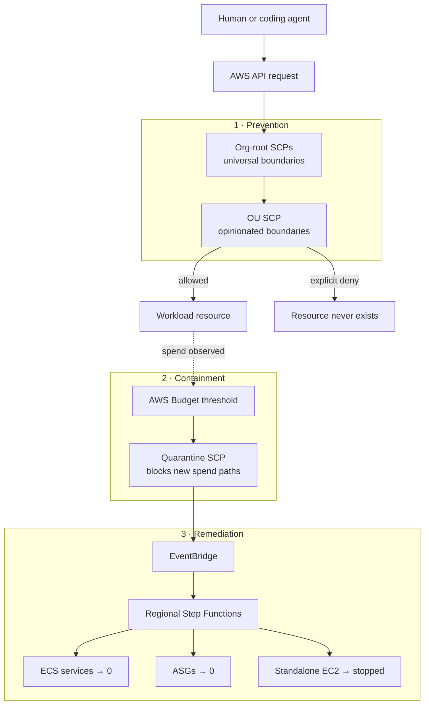

# Personal AWS Guardrails

**A cost-conscious home landing zone for the agentic age.**

Your coding agent offers to "make this production-ready." It adds a NAT Gateway,
an Application Load Balancer, a Secrets Manager secret for every credential,
several KMS customer-managed keys, and a monitoring dashboard. Each choice is
defensible in an enterprise, where a few dollars of baseline spend may be
immaterial. In a personal account, those same defaults can consume an entire
monthly budget without adding value to the project.

Personal AWS Guardrails (PAWS) adds layered controls to reduce the likelihood
and impact of that outcome. AWS Organizations service control policies (SCPs)
prevent selected resource patterns, AWS Budgets contain further activity after a
threshold, and multi-region Step Functions stop supported resources that are
already running.

> **The core idea:** reduce not only the blast radius of stolen credentials, but
> also the blast radius of a fully authorized, well-intentioned agent doing
> something you did not ask for, or did not notice in time.

> [!WARNING]
> This is risk reduction, not a watertight spending cap. Guardrails are better
> than no guardrails, and a contained incident is better than an uncontained one.
> Either can still cost money.
>
> This project was written with AI assistance and is offered as a starting point,
> not a prescription for every AWS account. Some controls address uncommon or
> expensive failure scenarios that are impractical to exercise exhaustively.
> Inventory your existing resources, policies, identities, and stacks before
> deployment: these defaults may conflict with workloads you already operate.
>
> The intended workflow is agent-assisted: use your own coding agent to inventory,
> customize, stage, and verify the controls for your accounts. You remain
> responsible for the resulting architecture, approvals, recovery path, and bill.
> Read [What this does not solve](#what-this-does-not-solve) before relying on it.

## Why this exists

Cloud guardrails usually assume one of two threats: stolen credentials, or a
person making a mistake. This project adds a third that has become common with
coding agents: software using the admin permissions I gave it to build something I
would not have approved if I had looked closely. The agent is doing its job. It
just defaults to what works in a company, like high availability, managed
databases, and dedicated networking, none of which I want on a personal bill.

Instructions and code review help, but they are not a boundary. A cost note can
fall out of the agent's context, an expensive line can sit unnoticed in a big
diff, or a loop can keep retrying until something sticks. Billing data shows up
hours later, long after the resource was created. An SCP closes that gap: the
denied API call fails before anything exists, so the agent has to pick a cheaper
path or come back and ask.

## Who this is for

This project is a good fit if you:

- operate one or more personal AWS accounts and pay the bill yourself;
- use coding agents to build or deploy infrastructure;
- favor serverless, event-driven, and AI/LLM workloads;
- want broad workload permissions inside deliberately narrow boundaries;
- prefer temporary downtime over an open-ended bill;
- want a starting point you can fork and make more or less opinionated.

It is **not** a production enterprise landing zone, a compliance framework, a
replacement for AWS Control Tower, or a guarantee that AWS spend cannot occur.
It is small, reviewable, and opinionated.

## Tenets

1. **Prevention before detection.** An SCP denial is immediate. A budget alert
   depends on delayed billing data.
2. **Prefer downtime over runaway bills.** Brief unavailability is acceptable in
   this environment; forgotten infrastructure charging indefinitely is not.
3. **Deny by default, allow by exception.** A service has to justify its presence
   in the workload accounts.
4. **Separate universal boundaries from personal choices.** Org-root policies
   contain broadly sensible paws-account protections. One OU-level policy holds
   the choices another operator may reasonably disagree with.
5. **Constrain valid automation, not only attackers.** Administrator permissions
   do not imply permission to create every AWS architecture pattern.
6. **No long-lived workload credentials.** Workload accounts use Identity Center
   sessions and service roles, not IAM users, access keys, SSH keys, or
   service-specific credentials.
7. **Keep controls understandable and reversible.** Policies deploy detached by
   default, attachment is explicit, and the management account remains the
   recovery path.

## Architecture

The system applies three cost-control stages around separately authenticated
management and workload identities:



Most mistakes stop at prevention. Containment and remediation exist for allowed
services that become unexpectedly expensive.

### Organization shape

```text
Organization root
├── management account       ← billing, SCP management, quarantine orchestration
├── Prod OU
│   └── production account   ← stable personal workloads
└── Test OU
    └── test account         ← experiments and higher change frequency
```

SCPs never apply to the management account. AWS excludes it by design, even if a
policy tries to target it. This project relies on that: the management account
stays the recovery boundary if a member-account policy is wrong.

### Two functional SCP layers

```mermaid
flowchart TD
    Root[Organization root]
    Prod[Prod OU]
    Test[Test OU]

    Root --> Universal[Universal paws-account guardrails]
    Universal --> U1[Security baseline]
    Universal --> U2[Coarse five-region ceiling]
    Universal --> U3[Service allowlist]
    Universal --> U4[No capacity commitments]

    Root --> Prod
    Root --> Test
    Prod --> Opinionated[Opinionated cost guard]
    Test --> Opinionated

    Opinionated --> O1[Small EC2 only]
    Opinionated --> O2[No costly networking]
    Opinionated --> O3[No managed databases / clusters]
    Opinionated --> O4[No recurring best-practice extras]

    Prod --> Regional[Regional specialization]
    Test --> Regional

    Regional --> R1[us-east-1: globals only]
    Regional --> R2[ap-southeast-1: cleanup only]
    Regional --> R3[us-west-2: Bedrock only]
    Regional --> R4[eu-north-1: S3 backup + Bedrock]
    Regional --> R5[Object Lock protection]

    classDef structure fill:#bcd0ee,stroke:#3b5b92,color:#1a2b45;
    classDef policy fill:#a8dcb8,stroke:#2f7d43,color:#12331d;
    classDef universalItem fill:#d9f0e0,stroke:#5a9e6f,color:#12331d;
    classDef opinionatedItem fill:#f8d9b0,stroke:#b3701f,color:#4a2e08;
    classDef regionalItem fill:#e0d4f5,stroke:#6b4fa0,color:#2d1f4e;

    class Root,Prod,Test structure;
    class Universal,Opinionated,Regional policy;
    class U1,U2,U3,U4 universalItem;
    class O1,O2,O3,O4 opinionatedItem;
    class R1,R2,R3,R4,R5 regionalItem;
```



**Org root: organization-wide outer boundaries.** These define encryption and
credential invariants, a coarse region ceiling, the set of services that may
exist in this particular home environment, and no long-term capacity purchases.
The security invariants are broadly reusable; forks should review the service
allowlist against their own needs.

**OU level: explicit opinionated defaults.** One policy makes cost choices easy
to find and customize: no RDS, no load balancers, no customer-managed KMS keys,
small EC2 sizes, and similar constraints. Some statements intentionally repeat
org-root exclusions as defense in depth. Allowing such a service may therefore
require changing both the root allowlist and the OU policy.

**OU level: regional specialization.** Each allowed region has a defined purpose.
Regions get only the permissions their purpose requires:
- eu-central-1 is the unrestricted primary working region
- us-east-1 exists only for CloudFront/ACM/WAF (global-service necessities)
- us-west-2 exists only for Bedrock model availability
- eu-north-1 serves as S3 cross-region backup and Bedrock access
- ap-southeast-1 is in cleanup mode (read + delete only, no new resources)

The Object Lock protection (`s3:BypassGovernanceRetention` denied) applies
across all regions, making governance-mode locks unbreakable from member
accounts while preserving an org-level escape hatch.

### Components

| Component | Responsibility | Deployment scope |
|---|---|---|
| [`scp-guardrails`](./scp-guardrails) | Prevent unsupported services and expensive configurations | Management account; policies target root/OUs |
| [`org-policies`](./org-policies) | Declarative EC2/S3 enforcement, AI opt-out, data perimeter (RCP) | Management account; policies target root |
| [`cost-quarantine`](./cost-quarantine) | Attach containment SCP and remediate ECS, ASG, and EC2 across regions | Management + workload accounts via StackSets |
| [`budget-alarms`](./budget-alarms) | Organization-wide budget safety net | Management account |
| [`idc-permission-sets`](./idc-permission-sets) | Separate management and workload identities | IAM Identity Center |
| [`account-baseline`](./account-baseline) | S3 public-access block, EBS encryption, IMDSv2, optional GuardDuty | Each account |
| [`scheduled-switch`](./scheduled-switch) | Stop idle resources on a schedule so nothing runs (and bills) around the clock by accident | Workload accounts |

The remediation path uses **zero Lambda functions**: Step Functions AWS SDK
integrations, JSONata, EventBridge, and cross-account roles do the work.

Prevention, containment, and remediation handle resources you did not want.
[`scheduled-switch`](./scheduled-switch) handles resources you *do* want, but
only some of the time: it powers eligible workloads down on a schedule so an
instance left running overnight or over a holiday does not quietly accumulate
cost. Timely shutdown is itself a guardrail for a personal account. This
capability is also covered in a separate blog post; it is kept in this
repository because it belongs to the same cost-discipline story.

## What success looks like

### An expensive default is rejected

```console
$ aws kms create-key
AccessDeniedException: explicit deny in a service control policy
```

Default encryption still works through no-additional-charge service-managed or
AWS-managed encryption options. The policy blocks the unnecessary recurring
customer-managed key.

### A spend breach is contained automatically

```text
Budget action → quarantine SCP attached → regional events forwarded
             → ECS desired count 0 → ASG desired capacity 0 → EC2 stopped
```

### The full remediation flow is testable

The included integration test creates a temporary Fargate service, a nano-sized
ASG, and a standalone nano EC2 instance, then verifies:

```text
ECS service desired count: 0  ✓
ASG desired capacity:      0  ✓
Standalone EC2 state: stopping ✓
State machine: SUCCEEDED
```

See [`cost-quarantine/test-remediation-full.sh`](./cost-quarantine/test-remediation-full.sh).
It creates short-lived billable resources and requires active management and
workload SSO sessions.

## Guardrails in practice

Architecture and tenets come first; the controls below are implementation
choices, not universal truths. Prices are illustrative and vary by region and
over time. Verify current AWS pricing before relying on them.

### Selected resources blocked

| Resource or configuration | Typical cost concern | Control |
|---|---:|---|
| NAT Gateway | ~$32+/month before data | Hard deny |
| ALB/NLB | ~$16+/month before usage | Hard deny |
| EKS control plane | ~$72/month | Service denied |
| RDS / ElastiCache / OpenSearch | Always-on managed capacity | Service/action denied |
| KMS customer-managed key | $1/key/month | `kms:CreateKey` denied |
| Elastic IP | ~$3.60/address/month | `ec2:AllocateAddress` denied |
| CloudWatch dashboard | $3/dashboard/month | Denied unless intentionally exempted |
| Provisioned Lambda or Bedrock capacity | Recurring commitment | Provisioning actions denied |
| io1/io2 EBS | Provisioned-IOPS charges | Denied; use gp3 |
| EC2 larger than nano/micro/small | Higher hourly rate | Instance-type condition deny |
| Reserved capacity / Dedicated Hosts | Long-term commitment | Purchase/allocation denied |
| IAM users and long-lived credentials | Persistent security exposure | Creation paths denied |

### Deliberately supported building blocks

| Building block | Intended use |
|---|---|
| Lambda, API Gateway, EventBridge, SQS, SNS, Step Functions | Serverless applications |
| S3, S3 Files, DynamoDB | Pay-per-use storage and data |
| CloudFront and Route 53 | Public delivery and DNS without load balancers |
| ECS/Fargate and small EC2 | Containers and general compute |
| Bedrock on-demand | AI/LLM experimentation without provisioned throughput |
| VPC, subnets, route tables, internet gateways | No-hourly-charge network foundation |
| CodeCommit | IAM-native source control |
| Resource Explorer | Cross-region resource discovery |

The complete namespace inventory, rationale, bypasses, and residual risks live in
[`scp-guardrails/README.md`](./scp-guardrails/README.md). The evolving analysis
and future work are recorded in [`PLAN.md`](./PLAN.md).

## Quick start

### Prerequisites

- An existing AWS Organization with SCPs enabled
- IAM Identity Center with separate management and workload identities
- AWS CLI v2 and `cfn-lint`
- Named SSO profiles; no access keys
- AWS-managed `FullAWSAccess` SCP retained (these policies subtract permissions)

### Validate and deploy detached

```bash
git clone <repository-url>
cd personal-aws-guardrails

cfn-lint scp-guardrails/cloudformation/*.yaml
bash -n scp-guardrails/deploy.sh

aws sso login --profile paws-mgmt-landing
AWS_PROFILE=paws-mgmt-landing ./scp-guardrails/deploy.sh
```

That creates or updates the policies **without attaching them**. Review the
rendered policies and current Organization state before changing enforcement.

### Attach deliberately

```bash
AWS_PROFILE=paws-mgmt-landing ./scp-guardrails/deploy.sh \
  --org-root-id r-XXXX \
  --opinionated-targets ou-XXXX-XXXXXXXX
```

The script displays the attachment plan and requires typing `ATTACH`. Start with
Test, verify normal create/read/update/delete paths, and only then roll out to
Prod. See [`scp-guardrails/README.md`](./scp-guardrails/README.md#deploy) for the
full procedure.

## Make it yours

The project is designed to be forked. The important distinction is *why* a
control exists:

| Goal | Change |
|---|---|
| Permit a new AWS service everywhere | Add its IAM namespace to the org-root allowlist |
| Permit an opinionated exception | Remove or narrow the relevant OU-level deny |
| Allow larger EC2 sizes | Edit `DenyEc2LargerThanSmall` |
| Permit RDS for one environment | Add RDS actions to the root allowlist, then remove or condition the OU deny |
| Change the regional ceiling | Set `AllowedRegions` when deploying |
| Keep security controls without cost opinions | Retain the security baseline; customize the root allowlist and leave the OU policy detached |
| Add stricter Prod/Test differences | Use separate OU policy targets or additional OU policies |

Every deny should document its intent, expected cost, and a safe alternative.
That makes forks deliberate rather than cargo-culted.

## What this does not solve

- **The management account is outside SCP enforcement.** Protect its identities
  carefully; it can detach these policies.
- **Budgets are delayed.** Billing ingestion can lag by hours. Quarantine is a
  damage limiter, not a real-time spending cap.
- **Some consumption cannot be bounded by SCP condition keys.** Examples include
  Lambda runtime concurrency, CloudWatch Logs ingestion volume, DynamoDB
  on-demand spikes, and S3 data-transfer volume.
- **Allowed pay-per-use services can still become expensive.** Lambda loops,
  public API traffic, Bedrock tokens, or S3 egress remain risks.
- **This configuration reflects one person's trade-offs.** RDS, EFS, ALBs, or
  customer-managed keys may be appropriate in another home lab.
- **AWS introduces new services.** A newly launched service may carry charges
  beyond a personal budget and will not be in the deny list until you add it.
  Re-review the allowlist when AWS launches services you might use.

## FAQ

**Why not use AWS Control Tower?**
Control Tower suits a small startup, but it is already oversized for a home
account. It layers on AWS Config to record and evaluate resource configurations,
useful for company compliance, rarely needed at home, and that adds ongoing
overhead. AWS Config bills per configuration item recorded, so in an active
account it can itself become a cost. This project stays lighter: a small set of readable templates you can inspect, fork,
and delete in an afternoon. If you later outgrow it, Control Tower remains a
reasonable next step.

**Isn't an AWS Organization with OUs over-engineered for a personal setup?**
An AWS Organization comes at no additional charge and is far lighter than
Control Tower, so it adds structure without adding overhead. The OU level is
where SCPs attach, and SCPs are the whole point of this project.
Whether you want two OUs with two accounts or a single OU with one account is up
to you: this repository models two so you can separate Test from Prod, but a
simple sandbox works fine with one.

**Wages are much lower where I live. Is this safe for me to use?**
Judge it by what a bad month could cost you. As a rough heuristic: if an
unexpected $100 charge would be a real hardship, do not put a payment-backed AWS
account at risk at all. Prefer the AWS Free Tier, a short-lived sandbox, or a training
account. If $100 would merely annoy you, this project can
lower the odds and size of a surprise, but read
[What this does not solve](#what-this-does-not-solve) first: it reduces risk
rather than removing it.

**Can my monthly bill still exceed the budget threshold?**
Yes. Budgets act on delayed billing data, some usage cannot be capped by policy
(for example Lambda concurrency, log ingestion, DynamoDB on-demand spikes, or
data transfer), and the management account itself is outside SCP enforcement.
Quarantine limits damage; it is not a hard spending cap. See
[What this does not solve](#what-this-does-not-solve).

**Will this break my existing workloads?**
It can, if attached without review. The policies are opinionated and deny many
services outright. Inventory your current resources first, deploy detached, and
attach incrementally starting in Test. Treat the defaults as a starting point to
tailor, not a drop-in.

**How does this relate to my own prompts and my agent's built-in safeguards?**
It complements them. Clear prompts, small diffs, and reviewing what your agent
proposes still matter; these guardrails are the backstop for the times an
instruction is missed or a change slips through review.

**Can I adopt only some of the components?**
Yes. They are independent. Start with just `scp-guardrails`, add `budget-alarms`,
and adopt `cost-quarantine` or `scheduled-switch` later, or never.

## Recommended rollout

There is intentionally no one-shot installer. Use separate, reversible phases:

1. Inventory the existing Organization, accounts, OUs, policies, and stacks.
2. Bootstrap permanent management access through
   [`idc-permission-sets`](./idc-permission-sets).
3. Apply [`account-baseline`](./account-baseline) account by account.
4. Create SCPs detached; inspect them; attach incrementally starting in Test.
5. Deploy [`budget-alarms`](./budget-alarms) without creating an alerting gap.
6. Deploy [`cost-quarantine`](./cost-quarantine) with remediation disabled first.
7. Enable remediation and run the included end-to-end tests.

Use SSO for every deployment. Keep one console-only, MFA-protected break-glass
IAM user in the management account with **zero access keys**; workload accounts
must have no IAM users.

## Documentation map

- [SCP policy rationale, deployment, and rollback](./scp-guardrails/README.md)
- [Quarantine architecture and testing](./cost-quarantine/README.md)
- [Identity Center bootstrap and permission sets](./idc-permission-sets/README.md)
- [Account security baseline](./account-baseline/README.md)
- [Budget alarm deployment](./budget-alarms/README.md)
- [Design backlog and service-by-service analysis](./PLAN.md)

## Contributing

Issues and discussions are welcome, especially for:

- newly introduced AWS services or pricing traps;
- controls with a better low-cost alternative;
- false positives that block ordinary home workloads;
- documentation, tests, and portability improvements;
- alternative opinionated policies for different paws-lab styles.

When proposing a policy change, explain the threat or cost model, who may
disagree, and how the behavior can be tested safely.

## License

Released under the [MIT No Attribution (MIT-0) license](./LICENSE).
